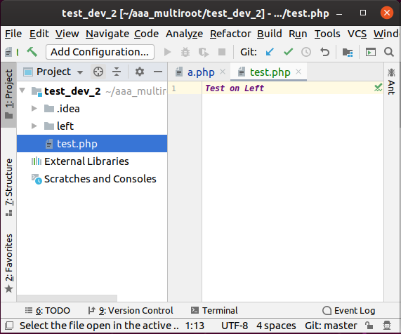
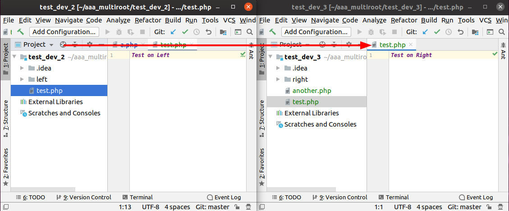
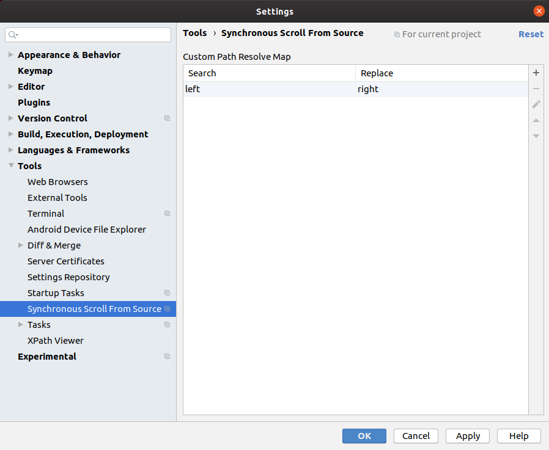
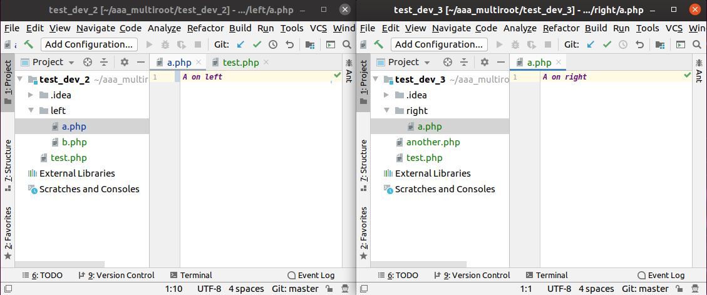
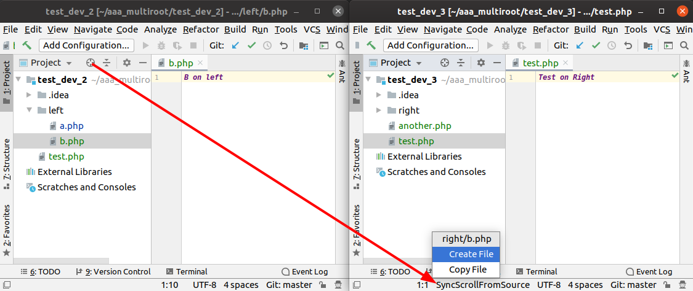
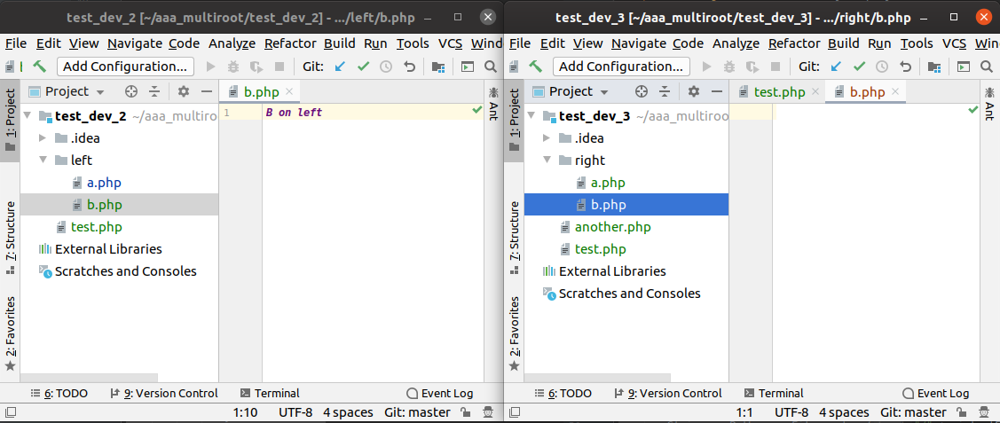
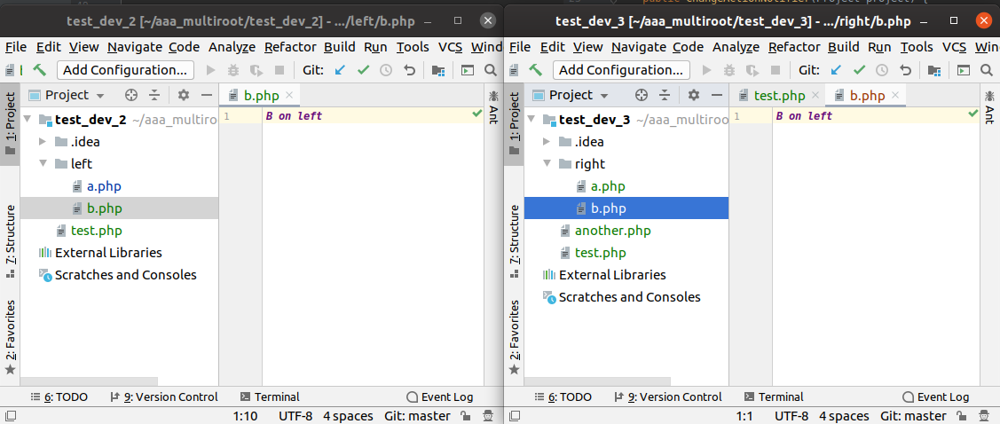

# Synchronous Scroll From Source

"Select Opened File" also known as "Scroll From Source" is a nice Feature to find the current File in the Project Tree...

## DoubleClick!
This Plugin expand the default Feature to all other open Instances simply by double-click instead of a single-click!...

## Custom Path Matching
In real life Projects are different
Add custom search/replace pairs to archive complex matching 

## Create/Copy File if not Exists
If a File even after your custom matching rules doesnt match, then you may want to Create or Copy the File, right?
So you get a Statusbar-Menu as a Fallback then!

### Created

### Copied
